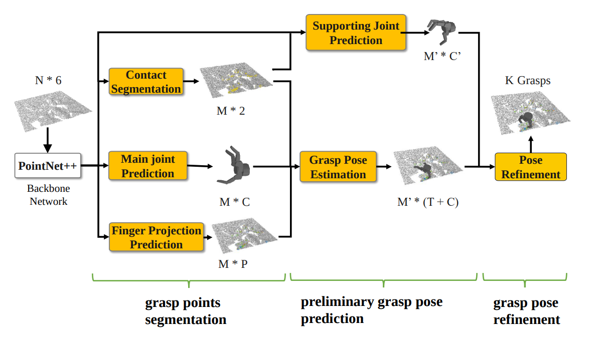

# CMG-Net

Baseline model for "CMG-Net: An End-to-End Contact-based Multi-Finger Dexterous Grasping Network" (ICRA 2023).

[[arXiv]](https://arxiv.org/abs/2303.13182)

In this repository, we propose an end-to-end deep neural network, CMG-Net, for multi-finger grasping.



## Requirements

- Ubuntu 18.04 LTS
- Python 3.7
- PyTorch 1.7
- Pybullet

## Installation

This code has been tested with python3.7, pytorch 1.7, CUDA 10.1

Create the conda env

```bash
conda env create -f environment.yml
```

Compile and install pointnet2 operators (code adapted from [VoteNet](https://github.com/facebookresearch/votenet))

```angular2html
cd pointnet2
python setup.py install
```

Get Pyrender with OSMesa follow [here](https://pyrender.readthedocs.io/en/latest/install/index.html#osmesa)

## Download Models and Data

### CMG-Net Model

Download trained model from [here](https://drive.google.com/file/d/1fKSJkr5NFhfsgUBlcbNeILf_RUfZIUoP/view?usp=sharing) and extract it into the `checkpoints/` folder.

### Object Model

Download object models from [here](https://drive.google.com/file/d/11rmdNB0lsc9qILnlZo5QoP110xVpfA6-/view?usp=sharing), extract them to the `dataset/` folder and place them in the following structure:
```
dataset
|-- urdfs
|  |-- barrett_object
|  |-- setup
```

### Training Data

Download a mini-dataset from [here](...) and extract it to the folder:
```
dataset
|-- view_7
```

### Test Data

Download 50 test scenes from [here](https://drive.google.com/file/d/12pvVOBYklALKGSUucHvJ2FtJX1mhbKO_/view?usp=sharing) and extract it to the folder:
```
dataset
|-- test
```

## Inference

CMG-Net can output multi-finger hand configurations and grasp poses for an input single-shot viewpoint in a cluttered scene.

Using test scenes to test our CMG-Net and evaluate the Successful Rate(SR) in simulation, execute: 

```shell
python3 test.py --use_normal --checkpoint_path checkpoints/36_vw7_1155_2048.pth
```

## Training

### Training CMG_Net

Start training with distributed data parallel: 

```shell
python -m torch.distributed.launch --nproc_per_node=1 train.py --use_normal
```

Notes:
- Please refer to the code to make changes to the relevant parameters.
- The parameters for the camera and point cloud are in `config/config.yaml`

## Citation

Please cite our paper in your publications if it helps your research:

```
@inproceedings{wei2023cmgnet,
  title={CMG-Net: An End-to-End Contact-Based Multi-Finger Dexterous Grasping Network}, 
  author={Mingze Wei and Yaomin Huang and Zhiyuan Xu and Ning Liu and Zhengping Che and Xinyu Zhang and Chaomin Shen and Feifei Feng and Chun Shan and Jian Tang},
  year={2023},
  booktitle={Proceedings of the 2023 IEEE International Conference on Robotics and Automation (ICRA)},
}
```


## Dependencies

This project uses the following third-party code:

- [**PointNet2**](https://github.com/graspnet/graspnet-baseline/tree/main/pointnet2): Licensed under the [GraspNet-Baseline Software License Agreement](https://github.com/graspnet/graspnet-baseline/blob/main/LICENSE).
- [**pytorch_barrett_hand_forward_kinematics_layer**](https://github.com/aalto-intelligent-robotics/pytorch_barrett_hand_forward_kinematics_layer): Licensed under the [MIT License](https://github.com/aalto-intelligent-robotics/pytorch_barrett_hand_forward_kinematics_layer/blob/master/LICENSE).
- [**Volumetric Grasping Network**](https://github.com/ethz-asl/vgn/tree/corl2020): Licensed under the [BSD-3-Clause](https://github.com/ethz-asl/vgn/blob/corl2020/LICENSE).
- [**Contact-GraspNet**](https://github.com/NVlabs/contact_graspnet/tree/main): Licensed under the [NVIDIA Source Code License for Contact-GraspNet](https://github.com/NVlabs/contact_graspnet/blob/main/License.pdf).


## License
This project is licensed under [this license](LICENSE).

